～自己紹介～
  
突然ですが皆さん、飲んでいますか？プロテイン。  
「いや、自分は筋トレとかしてないし・・・」、「マッチョになりたくないし・・・」となった方、少し待ってください。  

ここ最近、「健康意識」でプロテインの新規購入者が10-20代女性、主要購入者が30-40代女性になっているという事実をご存じですか？  
（引用：「インテージ 知る Gallery」2021年01月15日公開記事　https://gallery.intage.co.jp/protein2020/）  
つまり、今回の話は「筋トレをしている・していない」に関わらず、多くの方を対象にしたお話です。もちろん、この記事を今読んでいるあなたもそうです。
  
この記事を通して、少しでもプロテインについて知っていただけたらと思います！

### はじめに：プロテインとは？（知ってる人は飛ばしてね）
まず初めに「プロテインとは何か」を手短に説明します。
英単語proteinの意味は「タンパク質」であり、卵や肉・大豆などに入っている五大栄養素の1つです。

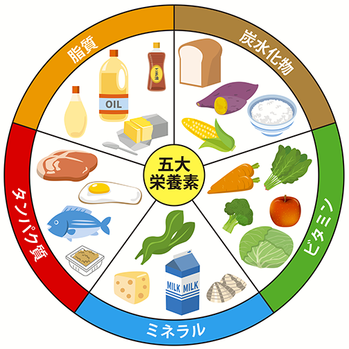  
画像：https://www.kenkomayo.com/pro/pg/1r-perfectsalad/

そんなタンパク質を粉状にして袋詰めし、あとは水や牛乳などに混ぜるだけでタンパク質飲料ができる、というのが一般的なプロテインです。要は「タンパク質の粉」ですね。

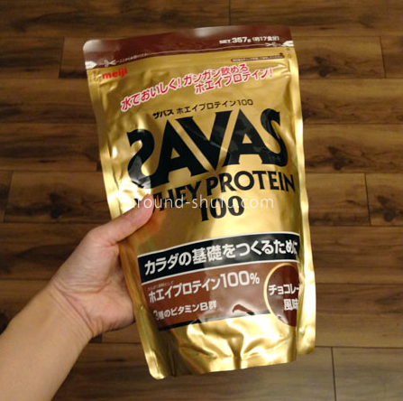  
↑袋の外観
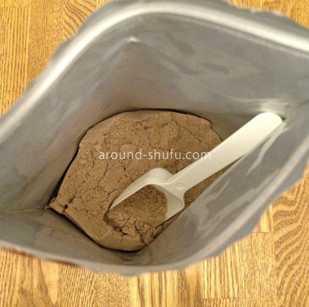  
↑袋の中身  
画像：https://around-shufu.com/savas-whey-chocolate/

（ちなみにタンパク質は筋肉の原料ですが、それだけでなく臓器・皮膚・髪などの原料にもなっており、非常に大事な栄養素です）

そしてプロテインの良いところは、やはり手軽に摂取できる点です。粉末とプロテインシェイカー、そして水さえあれば外でもいつでもタンパク質が摂取できます。これは便利！  

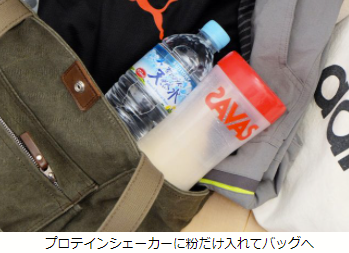  
画像：https://kw-note.com/food/how-to-use-a-protein-shaker/
  
タンパク質を摂るために、バッグに生卵なんて入れたくないですからね。割れます。  

・・・と、軽くプロテインについて説明した所で、いざ本題に入ります。

### 本当のプロテインとは何か？
「本当のプロテイン」とは・・・
「[マイプロテイン](https://www.myprotein.jp)」です。

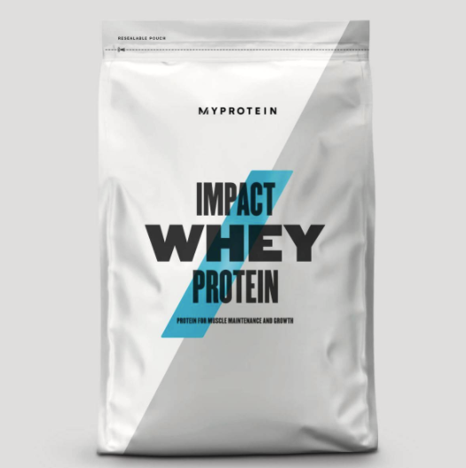  
画像：https://kw-note.com/food/how-to-use-a-protein-shaker/

（じぶん調べ）
  
すみません、ちょっとタイトルで攻め過ぎました。タイトルの真意は「今プロテインを買うなら、どのメーカーの商品が良いか？」ということです。 

それでは、なぜマイプロテインが良いのか説明していきます。

### なぜマイプロテインが良いのか
結論、この3つです。
- 安い
- 選べる「味」が多い
- 頻繁にセールを行っている

それぞれの詳細を説明します。

#### 安い
なんといっても、マイプロテインは安いです。
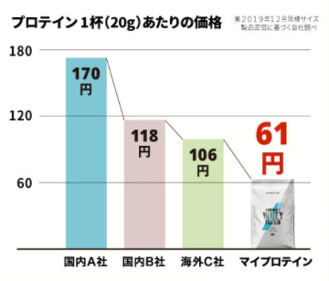  
画像：https://item.rakuten.co.jp/myprotein/10530943_1000_other/  

よりわかりやすくするために、身近な例で考えてみましょう。  
hoge市周辺のドラッグストア等で、一番手軽に手に入れられるSAVAS（ザバス）のプロテインと比較すると、次のようになります：

|商品名|1kgあたりの価格|
|----|----|
|ザバス| 約4000円|
|マイプロテイン| 約3200円 セール時:約2000円|

なんと、価格差はセール時で約2倍も違います！ザバスのプロテインを1kg買うのと同じ値段で、マイプロテインは2kg買うことができるのは強いです。

プロテインのメーカーは他にもいろいろありますが、値段を気にするならマイプロテイン一択と言ってもよいでしょう。  

#### 選べる「味」が多い
これも店頭で売られているプロテインには見られない強みです。   
マイプロテインで選択できる「プロテインの味」はなんと、60種類以上です！サーティワンのアイスよりも多いですね。
  
プロテイン定番の「ココア」「バニラ」はもちろん、それ以外も充実しています（下の画像をご確認ください）
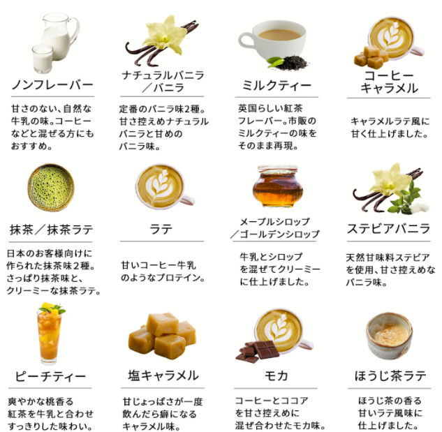  
画像：https://item.rakuten.co.jp/myprotein/10530943_1000_other/
  
また、参考までに人気フレーバーTOP10を載せると・・・
1. ナチュラルチョコレート
2. ミルクティー
3. 抹茶ラテ
4. ストロベリークリーム
5. モカ
6. 黒糖 ミルクティー
7. ピーチティー
8. ナチュラルストロベリー
9. 北海道ミルク
10. チョコバナナ
  
乳製品だったりチョコだったり、はたまた果物だったりと、非常に幅広いです。飽きたら味を変更できるのも強みですね。  
ちなみに僕はチョコレートブラウニー→モカという遍歴を辿り、今はモカで落ち着いています。長いことモカを飲んでますが、なかなか飽きが来ないのでオススメです。

#### 頻繁にセールを行っている
そしてマイプロテインと言えば！価格破壊のセールです。
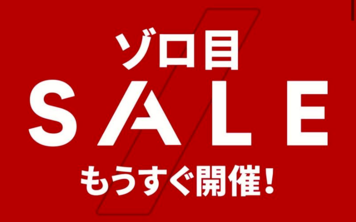  
画像：https://aumo.jp/articles/1060333
  
とんでもないことに、マイプロテインは最低月1回はセールしています。太っ腹。  
具体的な例として、直近1ヶ月で行われたセールを見てみましょう↓
- 11月01日：ミニゾロ目セール　特定商品が51%OFF
- 11月11日：ゾロ目セール
- 11月11日：LINE会員限定セール　全品56-60%OFF
- 11月21日：ブラックフライデー　プロテイン1kg×8が14690円
- 11月25日：ブラックフライデー　全品56%OFF
- 11月26日：3時間限定タイムセール　全品60%OFF
  
注目していただきたいのが「定価50%以上OFF」というセールの割合がそこそこ高い点です。このセール時にまとめてプロテインを買うことで、定期的に安くプロテインを買うことができます。というか、もう定価で買う事なんてできません！

以上3点が、マイプロテインをおすすめする理由です。

### マイプロテインのよくないところ
ここまでマイプロテインのよいところばかり紹介してきましたが、もちろんよくない点もあります↓
- 送料が高い
  - 購入金額8499円以下は送料1800円かかる
  - まとめ買いする人はいいけれど、「試しに買う人」にはとてもハードルが高い
- 海外製なので届くのに時間がかかる
  - だいたい2週間ほど
  - Amazonや楽天で買えば早く届きそうだが、割引クーポンが使えないので旨味ゼロ
- 味の当たり外れが大きい
  - 人気フレーバーTOP10のものを選んだり、ネット上のレビューを参考にすると安全
  - 初めての人は粉末プロテイン以外のものはできるだけ買わない方がいい（じぶん調べではハズレ率高し）

これらの欠点の中だと「送料が高い」「届くのに時間がかかる」という点が致命的ですね。。。なので本当に初めてのプロテインデビューをする場合は、近所で売っている小さなザバスプロテインを買って試すのがいいかもしれません。（僕も初プロテインはザバスでした。しかしザバスの高さが気になってきたら、それはマイプロテインへの替え時でしょう）

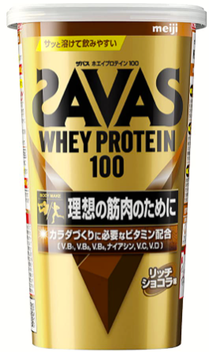  
画像：https://www.amazon.co.jp/ザバス-SAVAS-ホエイプロテイン100-リッチショコラ味【14食分】-294g/dp/B084DPDJXJ/ref=asc_df_B084DPDJXJ/?tag=jpgo-22&linkCode=df0&hvadid=342357125985&hvpos=&hvnetw=g&hvrand=16970751913121811144&hvpone=&hvptwo=&hvqmt=&hvdev=c&hvdvcmdl=&hvlocint=&hvlocphy=9053300&hvtargid=pla-911606850396&psc=1&th=1&psc=1

### 最後に：「初めてのお客様限定！お試しセット」で1kg1490円+送料無料
上記の通り、マイプロテインには「購入金額8499円以下は送料1800円かかる」という激高仕様があり、「マイプロデビューしようかな・・・」という人を門前払いする仕様となっております。  

うーん、どうしよう・・・（マイプロテインのTOPページを眺める）
  
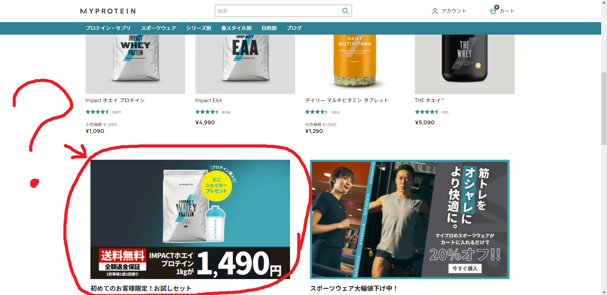  
  
こ、これは・・・！？
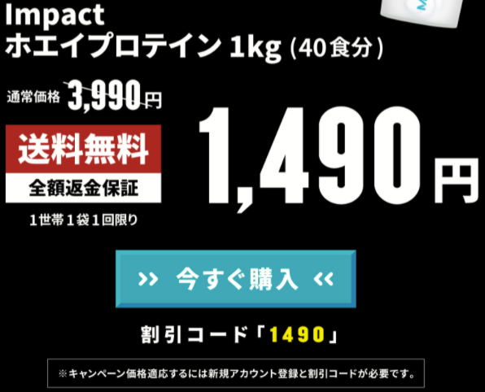  
画像：https://www.myprotein.jp/new-customer-lp/1490.list

なんと、2021年12月8日現在、マイプロテインでは「初めての方限定で送料無料」というお得なキャンペーンが開催されているようです！（この記事公開の時期とタイミングが良い！）
  
これは買うっきゃない！  
※なお、このキャンペーンは不定期のものなので、いつまで続くか不明です。興味を持たれた方はお早めにどうぞ。

# まとめ
「マイプロテイン」という単語だけ覚えていただければ幸いです。  
ここまで読んで頂きありがとうございました。

- （プロテインが社内で流行る→ついでにジム通いも流行る→会社の福利厚生に「ジム料金割引手当」がつく→🤩）  
- or （プロテインが社内で流行る→hogeルームで筋トレするのが流行る→トレーニング設備の充実、ベンチ・ラックの追加→🤩）